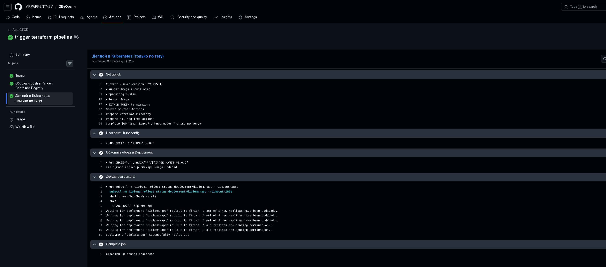
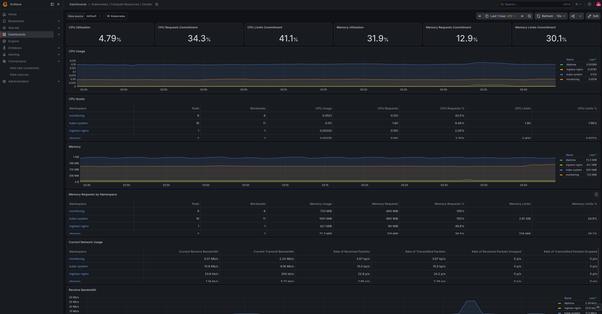
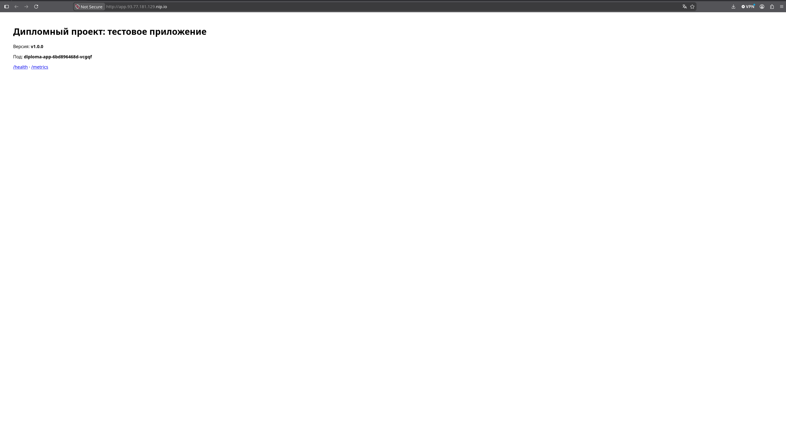
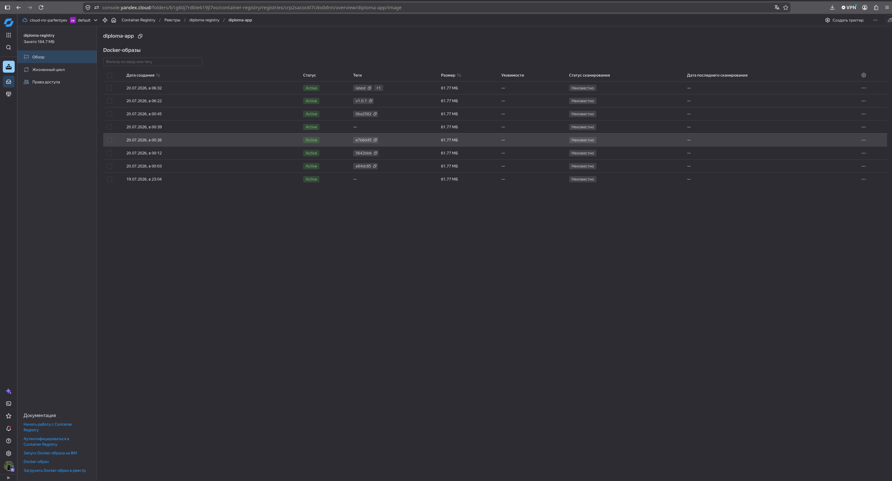
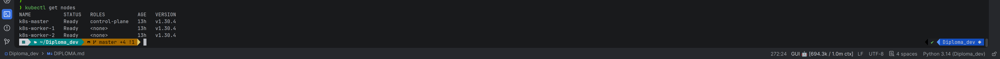

# Дипломный проект: облачная инфраструктура, Kubernetes и CI/CD в Яндекс.Облаке

**Автор:** _Парфентьев Владислав Сергеевич_
**Дата:** _<дата защиты>_
**Облачный провайдер:** Яндекс.Облако (Yandex Cloud)


---

## Оглавление

1. [Цель и задачи](#1-цель-и-задачи)
2. [Архитектура](#2-архитектура)
3. [Технологический стек и принятые решения](#3-технологический-стек-и-принятые-решения)
4. [Состав репозиториев](#4-состав-репозиториев)
5. [Соответствие правилам приёма](#5-соответствие-правилам-приёма)
6. [Демонстрация создания с нуля](#6-демонстрация-создания-с-нуля)
7. [Данные доступа](#7-данные-доступа)
8. [Чек-лист сдачи](#8-чек-лист-сдачи)

---

## 1. Цель и задачи

**Цель:** подготовить облачную инфраструктуру, развернуть Kubernetes-кластер, настроить мониторинг и
автоматический CI/CD для тестового приложения — полностью через код (IaC), с возможностью воспроизвести
всё «с нуля».

**Задачи (из ТЗ):**

1. Подготовить облачную инфраструктуру в Яндекс.Облаке при помощи Terraform.
2. Запустить и сконфигурировать Kubernetes-кластер.
3. Установить и настроить систему мониторинга.
4. Настроить сборку тестового приложения в Docker-контейнере.
5. Настроить CI для автоматической сборки и тестирования.
6. Настроить CD для автоматического развёртывания приложения.

**Ключевое ограничение:** бюджет купона ограничен → прерываемые (preemptible) worker-ноды, минимальная доля
ЦПУ (`core_fraction = 20`), один статический публичный IP, возможность быстро `terraform destroy`.

---

## 2. Архитектура

```
                                 Интернет
                                    │
                       (публичный статический IP)
                                    │
                        ┌───────────▼──────────────────────┐
                        │   ingress-nginx                  │  :80 / :443
                        │   (DaemonSet, hostNetwork        │
                        │    на master-ноде)               │
                        │   host-routing:                  │
                        │    app.<IP>.nip.io  → app        │
                        │    grafana.<IP>.nip.io → grafana │
                        └───────────┬──────────────────────┘
   VPC diploma-net (ru-central1)    │
   ┌────────────────────────────────┼───────────────────────────────┐
   │  subnet-a (zone a)   subnet-b (zone b)   subnet-d (zone d)     │
   │      ┌────────┐         ┌────────┐          ┌────────┐         │
   │      │ master │         │worker-1│          │worker-2│         │
   │      │ +etcd  │         │(preempt)│         │(preempt)│        │
   │      └────────┘         └────────┘          └────────┘         │
   │   kube-prometheus-stack (Prometheus/Grafana/Alertmanager/      │
   │   node-exporter) + тестовое приложение diploma-app (FastAPI)   │
   └────────────────────────────────────────────────────────────────┘

   Object Storage (S3)          ← Terraform state
   Yandex Container Registry    ← Docker-образ приложения
   GitHub Actions               ← CI (сборка/push) + CD (деплой) + terraform-пайплайн
```

**Потоки:**
- Terraform создаёт инфраструктуру, state хранится в S3-бакете Object Storage.
- Kubespray (Ansible) ставит Kubernetes на 3 ВМ.
- GitHub Actions собирает образ приложения → пушит в YCR → по тегу деплоит в кластер.
- Отдельный пайплайн применяет Terraform при изменениях в `main`.
- Доступ снаружи (:80) к приложению и Grafana — через один ingress-nginx с маршрутизацией по хосту.

---

## 3. Технологический стек и принятые решения

| Область | Выбор | Обоснование |
|---|---|---|
| IaC | **Terraform** (провайдер yandex-cloud) | Требование ТЗ; state в S3-бакете ЯО |
| Kubernetes | **Self-hosted, 3 ВМ, Kubespray/Ansible** | Рекомендуемый вариант ТЗ; полный контроль |
| Backend state | **S3-бакет (Object Storage)** | Рекомендуемый вариант; дёшево |
| Terraform-пайплайн | **GitHub Actions (CI-CD-terraform)** | Альтернатива Atlantis/TF Cloud, разрешённая ТЗ |
| Registry | **Yandex Container Registry** | Всё в одной облачной экосистеме, приватный |
| CI/CD | **GitHub Actions** | Бесплатные раннеры, всё в одном месте |
| Приложение | **FastAPI-стаб** (`/`, `/health`, `/metrics`) | Заглушка по ТЗ + осмысленный CI (pytest) и свои метрики |
| Мониторинг | **kube-prometheus-stack** | Prometheus + Grafana + Alertmanager + node-exporter «из коробки» |

**Экономия купона:** worker-ноды `preemptible`; `core_fraction = 20` на всех ВМ; один статический IP на
master-ноде; `terraform destroy` при простое.

---

## 4. Состав репозиториев

Всё хранится в **одном репозитории** на GitHub — монорепозиторий `diploma-devops` с четырьмя подпапками.
Ссылка на репозиторий: **https://github.com/MRPARFENTYEV/DEvOps**

| Папка | Назначение |
|---|---|
| `diploma-infra/` | Terraform: `bootstrap/` (SA, бакет, registry) + `infra/` (VPC, ВМ) |
| `diploma-ansible/` | Kubespray-инвентарь и настройки для установки кластера |
| `diploma-app/` | Тестовое приложение: код, Dockerfile |
| `diploma-k8s/` | Манифесты кластера: ingress-nginx, мониторинг, приложение |

CI/CD-воркфлоу лежат в корневом `.github/workflows/`: `terraform.yml` (инфраструктура) и
`app-ci-cd.yml` (сборка/деплой приложения).

---

## 5. Соответствие правилам приёма

> Ниже — по подразделу на каждый пункт правил приёма из ТЗ.

### 5.1. Репозиторий с конфигурацией Terraform + создание ресурсов с нуля

**Что сделано.** Инфраструктура полностью описана в `diploma-infra`. Две независимые конфигурации:
`bootstrap/` (сервисный аккаунт со scoped-ролями — не суперпользователь, S3-бакет под state, Container
Registry) и `infra/` (VPC + 3 подсети в зонах a/b/d, security group, 1 master + 2 preemptible worker,
статический IP). State основной конфигурации хранится в S3-бакете.

**Где.** `diploma-infra/bootstrap/*.tf`, `diploma-infra/infra/*.tf`.

**Как проверить.** Пройти по `diploma-infra/README.md`: `terraform apply` в `bootstrap`, затем `terraform
init -backend-config=... && terraform apply` в `infra`. Команды `terraform apply` и `terraform destroy`
отрабатывают без ручных действий.

### 5.2. Пример pull request и CI-CD-terraform pipeline

**Что сделано.** Вместо Atlantis/Terraform Cloud настроен собственный пайплайн в GitHub Actions
(разрешённая альтернатива): на **pull request** запускается `terraform plan` и постится комментарием в PR;
при **merge в main** запускается `terraform apply`.

**Где.** `diploma-infra/.github/workflows/terraform.yml`.

**Как проверить.** Создать демонстрационный PR с изменением в `infra/` → в PR появится комментарий с планом;
после merge — в Actions отработает apply.

### 5.3. Репозиторий с конфигурацией Ansible (способ создания кластера)

**Что сделано.** Кластер создаётся через **Kubespray** (Ansible). Репозиторий `diploma-ansible` содержит
инвентарь, оверрайды (`group_vars`: Calico, containerd, ipvs) и скрипт генерации инвентаря из
`terraform output`.

**Где.** `diploma-ansible/inventory/mycluster/`, `diploma-ansible/scripts/gen-inventory.sh`.

**Как проверить.** По `diploma-ansible/README.md`: сгенерировать инвентарь, склонировать Kubespray, прогнать
`cluster.yml`, забрать kubeconfig. Итог — `kubectl get nodes` показывает 3 узла Ready.

### 5.4. Репозиторий с Dockerfile + ссылка на собранный образ

**Что сделано.** Приложение `diploma-app` — FastAPI-сервис с самостоятельно написанным multi-stage
Dockerfile. Образ собирается в CI и публикуется в Yandex Container Registry.

**Где.** `diploma-app/Dockerfile`, `diploma-app/app/main.py`. Образ:
`cr.yandex/<YC_REGISTRY_ID>/diploma-app` — _ссылка/тег: <вставить>_.

**Как проверить.** `yc container image list` показывает образ; либо реестр в консоли ЯО.

### 5.5. Репозиторий с конфигурацией Kubernetes

**Что сделано.** Репозиторий `diploma-k8s` содержит все манифесты и values для наполнения кластера:
ingress-nginx (DaemonSet, hostNetwork), kube-prometheus-stack (values), ServiceMonitor и кастомный дашборд
приложения, Deployment/Service/Ingress приложения.

**Где.** `diploma-k8s/ingress-nginx/`, `diploma-k8s/monitoring/`, `diploma-k8s/app/`.

**Как проверить.** По `diploma-k8s/README.md` — установить ingress-nginx и kube-prometheus-stack через helm,
применить манифесты приложения. Grafana показывает дашборды кластера и приложения.

### 5.6. Ссылки на тестовое приложение и веб-интерфейс Grafana

**Что сделано.** И приложение, и Grafana доступны из интернета на :80 через ingress-nginx (маршрутизация по
хосту). Данные доступа — в разделе [7. Данные доступа](#7-данные-доступа).

**Где.** `diploma-k8s/app/ingress.yaml`, `diploma-k8s/monitoring/grafana-ingress.yaml`.

**Как проверить.** Открыть в браузере URL приложения и URL Grafana.

### 5.7. Всё на одном ресурсе (GitHub)

**Что сделано.** Всё хранится в одном монорепозитории `diploma-devops` на GitHub (см. раздел 4) — это
удовлетворяет требованию «хранить на одном ресурсе». Плюс работает CI/CD приложения: сборка+push при
коммите, деплой по тегу.

---

## 6. Демонстрация создания с нуля

Последовательность, которой можно вживую показать поднятие всех ресурсов (подробности — в README каждого репо).

```bash
# 1. Bootstrap: сервисные аккаунты, S3-бакет под state, registry
cd diploma-infra/bootstrap
cp terraform.tfvars.example terraform.tfvars   # вписать yc_token, cloud_id, folder_id, имя бакета
terraform init && terraform apply
terraform output -raw access_key               # ключи для backend (шаг 2)
terraform output -raw secret_key
terraform output registry_id

# 2. Основная инфраструктура (state в бакете)
cd ../infra
cp terraform.tfvars.example terraform.tfvars   # yc_token, cloud_id, folder_id, ssh_public_key
cp backend.hcl.example backend.hcl             # bucket + ключи из шага 1
terraform init -backend-config=backend.hcl && terraform apply
terraform output ansible_hosts                 # IP для инвентаря

# 3. Kubernetes через Kubespray
cd ../../diploma-ansible
./scripts/gen-inventory.sh ../diploma-infra/infra
git clone --branch release-2.26 https://github.com/kubernetes-sigs/kubespray.git
pip install -r kubespray/requirements.txt
ansible-playbook -i inventory/mycluster/hosts.yml -u ubuntu --become kubespray/cluster.yml
export KUBECONFIG=$PWD/inventory/mycluster/artifacts/admin.conf
kubectl get nodes

# 4. Наполнение кластера
cd ../diploma-k8s
helm upgrade --install ingress-nginx ingress-nginx/ingress-nginx -n ingress-nginx --create-namespace -f ingress-nginx/values.yaml
helm upgrade --install kube-prometheus-stack prometheus-community/kube-prometheus-stack -n monitoring --create-namespace -f monitoring/values.yaml
kubectl apply -f monitoring/ -f namespace.yaml -f app/   # после подстановки <YC_REGISTRY_ID> и <MASTER_IP>

# 5. Проверка CI/CD: коммит в diploma-app → образ в YCR; тег v1.0.0 → деплой в кластер
```

---

## 7. Данные доступа

| Ресурс | URL | Логин | Пароль |
|---|---|---|---|
| Тестовое приложение | http://app.93.77.181.129.nip.io/ | — | — |
| Grafana | http://grafana.93.77.181.129.nip.io/ | `admin` | `admin` |

> ⚠️ **IP привязан к конкретному развёртыванию.** После `terraform destroy` и повторного `apply` статический IP
> меняется — тогда адреса нужно обновить на новый `master_public_ip` (`terraform output` в `infra`).
> Пароль Grafana (`admin`) задан в `diploma-k8s/monitoring/values.yaml` — при желании смени перед сдачей.

---

## 8. Чек-лист сдачи

Легенда: ✅ готово · ⬜ ещё не сделано.
Разделено на «конфигурация» (написан и проверен код) и «развёрнуто» (запущено в облаке / запушено / есть ссылка).

| Пункт правил приёма | Конфигурация | Развёрнуто / ссылка |
|---|---|---|
| `diploma-infra` — Terraform (bootstrap + infra), создание с нуля | ✅ написана, `validate` OK | ✅ `apply` прошёл, ресурсы созданы |
| CI-CD-terraform pipeline: пример PR + apply в Actions | ✅ workflow готов | ✅ пайплайн зелёный (apply в Actions) |
| `diploma-ansible` — конфигурация Kubespray | ✅ готова | ✅ кластер поднят (3 ноды Ready) |
| `diploma-app` — Dockerfile + образ в YCR | ✅ готов | ✅ образ `diploma-app:latest` в YCR |
| `diploma-k8s` — манифесты Kubernetes, дашборды Grafana | ✅ готовы, YAML валиден | ✅ применены (ingress + мониторинг + app) |
| Ссылки на приложение и Grafana + данные доступа | — | ✅ работают (см. раздел 7) |
| CI/CD приложения: сборка при коммите, деплой по тегу | ✅ workflow готов | ✅ App CI/CD зелёный (сборка+push) |
| Всё в одном репозитории (монорепо `DEvOps`) | ✅ структура готова | ✅ запушен на GitHub |

скрины actions:

grafana

приложение в браузере

ycr

kubectl get nodes
